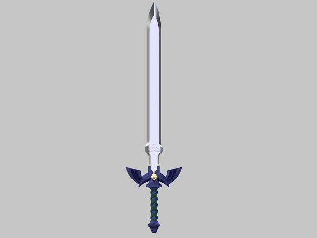
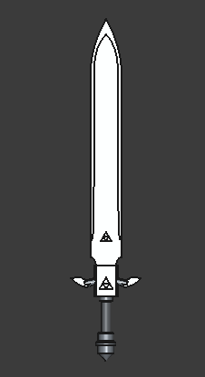
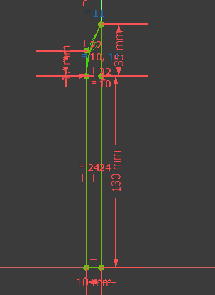
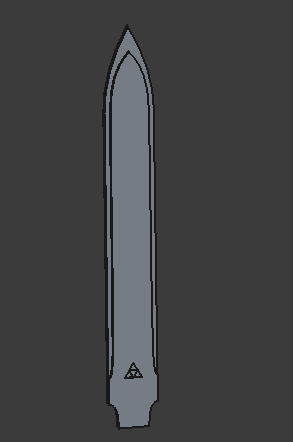
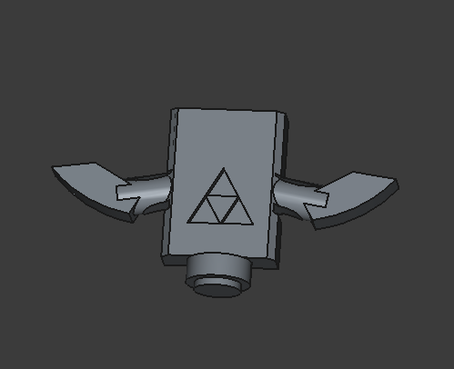

# Master-Sword-Design-Attempt-FreeCAD
I wanted to improve my 3D design skills, so I used FreeCAD to try and design the master sword from The legend of Zelda: Breath of the Wild.

## The blade
I started this part first since it was the largest. I padded twice on it to give the illusion of the metal swooping down like it is in the video game, since I didn't know how to achieve that in FreeCAD(but hopefully I will one day). I used mirroring to reduce symmetry errors. [Initial sketch on left, Final Blade on right]

## The Crossguard
This took the longest time. I used several datum planes, pocket operations and mirroring to allow it to **a)** House the blade and **b)** Look acceptable.[Datum planes on top, Final Crossguard on bottom]

